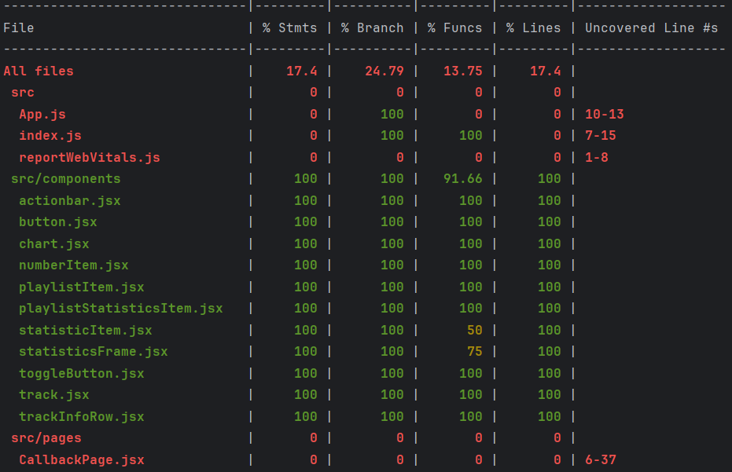
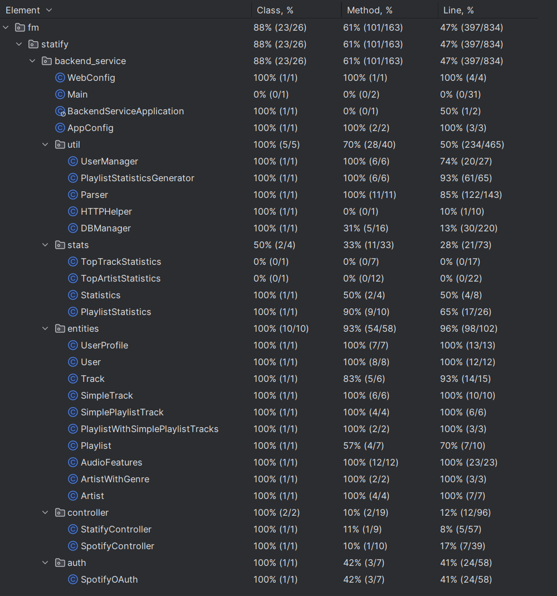

# Statify
## Test Report

### 1. Introduction
> This section provides an overview of the software testing process and the scope of the testing activities.
> 
### 2. Test Strategy
> This section describes the overall approach to testing, including the testing methodology, testing types, and testing techniques used. Highlight which automatic testing tools/frameworks are used for your project.

We integrated running of tests with GitHub Actions. Every time some code is pushed to the repository, frontend as well as backend tests are ran automatically. The test results are reported by using the [Test Reporter Github Action](https://github.com/marketplace/actions/test-reporter). You can view how many tests passed, how many failed and more.  

#### 2.1 Frontend
**Test Framework: Jest**  
[Link to tests](https://github.com/SE-TINF22B6/Statify/blob/develop/web_app/src/App.test.js)

#### 2.2 Backend
**Test Framework: JUnit**  
[Link to tests](https://github.com/SE-TINF22B6/Statify/tree/develop/backend_service/src/test/java/fm/statify/backend_service)

### 3. Test Plan
> This section outlines the specific testing tasks, timelines, and resources required to achieve the testing objectives.

#### 3.1 Tasks concerning Tests
[Identify a unit test framework for your project](https://github.com/SE-TINF22B6/Statify/issues/35)
[Implement a couple of unit tests in your source code](https://github.com/SE-TINF22B6/Statify/issues/36)
[Setup Github Actions for Tests](https://github.com/SE-TINF22B6/Statify/issues/88)
[Write Tests in the Frontend](https://github.com/SE-TINF22B6/Statify/issues/70)
[Write Tests in the Backend](https://github.com/SE-TINF22B6/Statify/issues/99)

### 4. Test Cases
> This section details the specific test cases that were executed, including their pass/fail status and any defects found during testing. (You may link to the repository of your use cases.)   

**Frontend Tests Status:** 
**Backend Tests Status:** 

#### 4.1 Frontend
##### Unit Tests for Components:
We have multiple Unit Tests for each component in order to cover all cases how the component might be used - e.g. with and without optional parameters.
- ActionBar
- Button
- Chart
- PlaylistItem
- PlaylistStatisticsItem
- StatisticsFrame
- StatisticsItem
- ToggleButton
- Track
- TrackInfoRow

#### 4.2 Backend
##### Testing the DatabaseManager Class:
- Test connection setup
- Test queries for the User table

##### Testing the HttpHelper Class:
- Test performing http requests

##### Testing the Parser class:
Here, we are testing the following parse methods, which should convert the json response we get from the spotify API into our own entity classes for Track, Artist, Playlist etc.

- parseUserProfile()
- parsePlaylists()
- parseTopTracks()
- parseSimpleTrack()
- parseTopArtists()
- parseArtist()
- parsePlaylistWithSimpleTracks()
- parsePlaylistTrack()
- parseArtists()
- parseAudioFeatures()
- parseTrackForPage()

##### Testing the PlaylistStatisticsGenerator class:
This class is responsible for generating the playlist statistics. It has to calculate the length of the playlist, count which Artist/Genre is represented most often in the playlist, etc.

##### Testing the UserManager class:
This class handles the user information. It contains a map with all the important information, such as a user's id, accesToken for the Spotify API, refreshToken, etc. Therefore it is neccessary to test if this class handles all the accessing and manipulation of user data correctly.

- Testing to add a user
- Testing to get a user's accessToken by userId
    - return the accessToken if it is still valid
    - refresh the access token, save new token to the database and return the new token if it is expired

### 5. Test Results 
> This section summarizes the results of the testing, including major defects found, their severity, and the steps taken to resolve them. (You may link to the test reports generated by your testing tool.)

By running our unit tests, we did not find any major defects in our application. When we had bugs in our application during the development process they were soon found while manually testing and navigating through the application.

A smaller bug that was found with the help of a Jest unit test, was the incorrect conversion from milliseconds to minutes in the frontend.

Another bug that was found while manually clicking through the frontend while developing was that because of a copy and paste mistake, if you tried to generate statistics for "long term" time range, it generated "medium term" statistics.

Most of the time, defects that were found could be resolved rather quickly, after the part of the program code that caused the bug was identified.

### 6. Metrics
> This section provides quantitative data on the testing process, such as the number of defects found, the defect resolution time, and the test coverage achieved.

#### 6.1 Test Coverage

##### 6.1.1 Frontend
In the Frontend, we focused mainly on writing unit tests for the single components we use in our application       

##### 6.1.2 Backend
In the backend we wrote tests for those classes which contain the most and most important business logic of our project in order to be sure that all the main functionality works as expected.

### 7. Recommendations
> This section offers suggestions for improving the testing process and the quality of the software.

In order to automate the process of finding smaller or larger defects in our application instead of relying on manual testing, we should have written more tests during the main development phase. 
In order to assure that all code being committed to the repository works correctly, tests should be written right after a new feature is implemented.

### 8. Conclusion
> This section summarizes the key findings of the testing and the overall status of the software quality.

Currently, all our tests succeed and as far as we know, our application does not contain any bugs.  
For test coverage there are still untested features, such as testing the Spring REST API. Overall, we implemented tests for most of the major features of our application.
